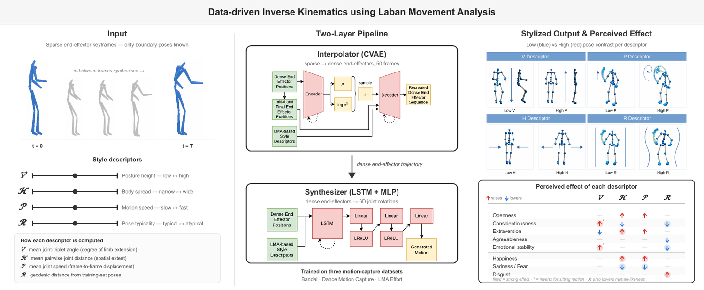

# Data-driven Inverse Kinematics using Laban Movement Analysis

Related publication:

> Mehmet Akif Şahin, Sinan Sonlu, Uğur Güdükbay,
> "Data-driven Inverse Kinematics using Laban Movement Analysis",
> Computers & Graphics, Vol. 138, Article No. 104643, 12 pages, August 2026.



## Overview

Inverse Kinematics (IK) determines the rotational configuration of body parts that satisfies a set of target end-effector positions. Most IK systems focus on the *physical* aspects of arranging limb configurations; the *psychological* qualities of motion -- the kind of expressive content choreographers describe with Laban Movement Analysis (LMA) -- are typically left to manual key-framing.

This repository introduces:

- A quantitative translation of the qualitative LMA Shape Qualities and Effort parameters into four continuous, differentiable style descriptors:
  - **V** (Vertical) -- mean angle over 11 joint triplets,
  - **H** (Horizontal) -- mean L2 distance over 13 joint pairs,
  - **P** (Pace) -- average per-joint speed across all joints,
  - **R** (Regularity) -- geodesic distance between predicted and ground-truth joint rotations plus the joint-wise standard deviation.
- A two-stage data-driven IK pipeline that takes sparse end-effector keyframes (hands and feet) plus user-specified LMA descriptor values and synthesizes a full-body 50-frame motion:
  - An **Interpolator** (Conditional VAE) that upsamples sparse end-effector keyframes into dense 50-frame trajectories conditioned on the LMA descriptors.
  - A **Synthesizer** (LSTM) that maps dense end-effector positions plus LMA descriptors to full-body joint rotations in 6D rotation representation.

A perception user study reported in the paper shows that the resulting system can systematically alter the perceived personality and emotion of the animation by varying the LMA-inspired descriptors.

## Repository Layout

```
.
|-- source/                     # Importable Python package
|   |-- __init__.py
|   |-- dataset.py              # MotionDataset, BVH ingestion, dataset factories
|   |-- interpolator.py         # Interpolator (CVAE) model
|   |-- synthesizer.py          # Synthesizer (LSTM) model
|   |-- laban.py                # LabanDescriptors: V / H / P / R
|   |-- forward_kinematics.py   # ForwardKinematics solver and rotation shims
|   `-- rotations.py            # 6D / matrix / quaternion / euler conversions
|
|-- notebooks/
|   |-- train_interpolator.ipynb
|   |-- train_synthesizer.ipynb
|   `-- userstudy_analysis.ipynb  # perception study analysis (Tables 5-7, Fig 12)
|
|-- assets/                     # README figures (graphical abstract, representative image)
|-- checkpoints/                # trained weights (interpolator.pth, synthesizer.pth)
|-- data/                       # datasets and built cache (lma_effort.pkl)
|-- results/                    # reproduction outputs (written by reproduce.py)
|
|-- reproduce.py                # no-parameter reproduction of the paper result
|-- install.sh                  # vanilla-install setup (venv + dependencies)
|-- submission.txt              # GRSI submission metadata (title / authors / OS)
|-- LICENSE                     # MIT (first-party code)
|-- LICENSE.pytorch3d           # BSD-3 (vendored rotation utilities)
|-- pyproject.toml
|-- README.md
`-- .gitignore
```

The trained weights in `checkpoints/` are included in the repository. The
datasets under `data/` and the outputs in `results/` are not tracked in git; see
`data/README.md` for where to obtain the datasets.

## Datasets

The pipeline is trained per dataset using a normalized skeleton specific to that dataset. The package provides three factory functions in `source.dataset`:

- `build_bandai_dataset` -- Bandai-Namco Research Motion Dataset 2 (Kobayashi et al., 2023, [arXiv:2306.08861](https://arxiv.org/abs/2306.08861)).
- `build_dance_dataset` -- Folk Dance Motion Capture (Aristidou et al., *JOCCH* 2015).
- `build_lma_effort_dataset` -- LMA Effort Dataset (Kim et al., *ACM TAP* 2022).

Each function defines the dataset-specific joint indices (`laban_skeleton`) and end-effector site IDs (`site_ids`) needed by `LabanDescriptors` and the IK loss. To target a new dataset, add a similar factory function that supplies the same role-based skeleton mapping.

## Third-Party Libraries

The following third-party libraries were used in the development of this work:

- [PyTorch](https://pytorch.org/)
- [bvhio](https://github.com/Wasserwecken/bvhio)
- [NumPy](https://numpy.org/)
- [tqdm](https://github.com/tqdm/tqdm)
- [Jupyter](https://jupyter.org/)

`source/rotations.py` contains rotation-representation utilities adapted from PyTorch3D and is distributed under the BSD-3-Clause license retained in the file header and reproduced in [`LICENSE.pytorch3d`](LICENSE.pytorch3d).

## Building

The code targets Python 3.11+ and runs on CPU or CUDA.

```bash
# create and activate a virtual environment
python3.11 -m venv .venv
source .venv/bin/activate

# install the package and its dependencies in editable mode
pip install -e ".[notebooks]"
```

For platform-specific CUDA or Apple Silicon wheels of PyTorch, follow the installation matrix at https://pytorch.org/get-started/locally/.

## Running

1. Place the BVH motion-capture files for the target dataset in a single folder.
2. Open `notebooks/train_interpolator.ipynb`, point cell 1 at that folder, and run all cells. The first cell builds the dataset pickle (motion windows, V/H/P features, normalized skeleton); the remaining cells train the `Interpolator` for 800 epochs with cyclical β-annealing (10 cycles, β ∈ [0.0, 0.01]). The best model is saved to `interpolator.pth`.
3. Open `notebooks/train_synthesizer.ipynb`, point it at the same dataset pickle, and run all cells. The `Synthesizer` is trained with the manuscript loss weights (λ\_IK=40, λ\_synth=1, λ\_V=λ\_H=λ\_P=1, λ\_R=2), AdamW + ReduceLROnPlateau, ±0.2 uniform noise on V and H, and uniformly randomized R targets. The best model is saved to `synthesizer.pth`.

At inference time the two stages compose: sparse end-effector keyframes plus user-specified LMA descriptor values pass through the `Interpolator` to produce a dense 50-frame end-effector trajectory, which the `Synthesizer` then converts to full-body joint rotations.

## Reproducing the paper result

`reproduce.py` regenerates the LMA descriptor-effect result (paper Figs 4–8) and runs with **no parameters**:

```bash
./.venv/bin/python reproduce.py
```

It expects:

- `checkpoints/interpolator.pth` and `checkpoints/synthesizer.pth` — the released model checkpoints (3.30 M and 5.62 M parameters, matching Table 3); see [`checkpoints/README.md`](checkpoints/README.md).
- `data/extracted_fingerless-*.zip` — the LMA Effort dataset BVH files (or an already-extracted `data/extracted_fingerless/`); see [`data/README.md`](data/README.md).

On the first run it extracts the dataset zip and builds the dataset cache `data/lma_effort.pkl` (one-off, a few minutes); subsequent runs take a few seconds. The script runs the full Interpolator → Synthesizer pipeline on 24 base motions at low vs. high values of each style descriptor and writes to `results/`:

- `descriptor_effect.txt` / `descriptor_effect.json` — the measured V/H/P descriptor for low vs. high conditioning. A higher measured value for the high setting reproduces the systematic style change shown in Figs 5–7.
- `motion_<D>_<low|high>.csv` — the generated full-body joint world positions (`frame, joint, x, y, z`) for one example base motion, i.e. the data underlying the low/high pose-comparison figures.

## License

This project is released under the [MIT License](LICENSE). The vendored
rotation utilities in `source/rotations.py` (adapted from PyTorch3D) are under
the BSD-3-Clause license in [`LICENSE.pytorch3d`](LICENSE.pytorch3d). All runtime
dependencies (PyTorch, bvhio, NumPy, tqdm, Jupyter) are permissively licensed
and free for academic use.

## Citation

Please cite this work if you find it useful:

```
@Article{SahinSG2026,
	author	=	{Mehmet Akif \c{S}ahin and Sinan Sonlu and U\u{g}ur G\"{u}d\"{u}kbay},
	title = {Data-driven Inverse Kinematics using Laban Movement Analysis},
	journal = {Computers \& Graphics},
	volume = {138},
	pages = {Article no. 104643, 12 pages},
	year = {2026},
	month	= {August},
	issn = {0097-8493},
	doi = {https://doi.org/10.1016/j.cag.2026.104643},
	url = {https://www.sciencedirect.com/science/article/pii/S0097849326001147},
	keywords = {Inverse kinematics, Laban Movement Analysis, Data-driven animation, Deep learning},
	abstract = {Inverse Kinematics (IK) provides control over animation, facilitating the creation of full-body poses by utilizing target end-effector locations. Many approaches address the physical aspects of arranging limb configurations; however, systems that consider the psychological aspects of human motion are lacking. To this end, we introduce a quantitative translation of the qualitative concepts of Laban Movement Analysis (LMA) into computable, continuous style descriptors. Building upon this formulation, we also propose a data-driven Inverse Kinematics (IK) method that directly utilizes these LMA parameters to refine generated animations. Specifically, we refer to LMA Shape Qualities and the attitude towards the Kinesphere to control the orientation of the generated pose along the vertical and horizontal axes. Our Interpolator upsamples sparse end-effector keyframes into dense paths and modulates Time Effort at the trajectory level. Flow Effort is controlled by a pose-similarity objective that deliberately reduces pose similarity to the dataset examples. Through a perception user study, we show that the system can successfully apply LMA-based changes to the motion to express different personality traits. This data-driven system can ease the process of controlling the psychological aspect of generative animation.}
}
```
